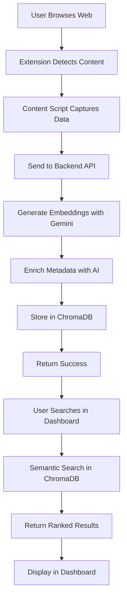

# 🧠 Recallhub

<div align="center">

**Your Personal Memory Layer for the Web**

A powerful AI-powered system that captures, stores, and intelligently retrieves your web conversations and content across any website.

[](https://opensource.org/licenses/MIT)
[](https://www.python.org/)
[](https://nextjs.org/)
[](https://fastapi.tiangolo.com/)

</div>

---

## 📋 Table of Contents

- [Overview](#-overview)
- [Features](#-features)
- [Architecture](#-architecture)
- [Tech Stack](#-tech-stack)
- [Prerequisites](#-prerequisites)
- [Installation](#-installation)
- [Configuration](#-configuration)
- [Usage](#-usage)
- [Project Structure](#-project-structure)
- [API Documentation](#-api-documentation)
- [Workflow](#-workflow)
- [Development](#-development)
- [Troubleshooting](#-troubleshooting)
- [Contributing](#-contributing)
- [License](#-license)

---

## 🌟 Overview

**Recallhub** is an intelligent memory system that automatically captures your interactions across the web, stores them with semantic embeddings, and provides powerful search and retrieval capabilities. Think of it as a second brain that remembers everything you've read, discussed, or interacted with online.

The system consists of three main components:
1. **Browser Extension**: Captures content from any website
2. **Backend API**: Processes and stores data with AI embeddings
3. **Dashboard**: Search and manage your stored memories

---

## ✨ Features

### 🎯 Core Features
- **Universal Content Capture**: Automatically captures conversations from ChatGPT, Claude, Gemini, and any web content
- **AI-Powered Embeddings**: Uses Google's Gemini AI for semantic understanding
- **Semantic Search**: Find content by meaning, not just keywords
- **Smart Metadata Enrichment**: Automatically extracts topics, entities, and categories
- **Real-time Sync**: Instant synchronization across extension and dashboard
- **User Isolation**: Multi-user support with automatic user ID management

### 🔍 Advanced Capabilities
- **Context Generation**: AI-generated summaries of your conversation history
- **Type Filtering**: Search by content type (chat, article, documentation, etc.)
- **Similarity Scoring**: Find the most relevant memories
- **Timestamp Tracking**: Complete history with temporal organization
- **URL Tracking**: Link back to original sources

---

## 🏗️ Architecture

```
┌─────────────────┐
│  Browser Pages  │
│   (Any Site)    │
└────────┬────────┘
         │
         ▼
┌─────────────────┐
│    Extension    │
│  (Content.js)   │◄─── Injects into pages
└────────┬────────┘
         │
         ▼ HTTP/REST
┌─────────────────┐
│  FastAPI Server │
│    (Backend)    │◄─── Processes & Stores
│   ChromaDB +    │
│   Gemini AI     │
└────────┬────────┘
         │
         ▼ HTTP/REST
┌─────────────────┐
│  Next.js Web    │
│   (Dashboard)   │◄─── Search & Manage
└─────────────────┘
```

### Data Flow
1. **Capture**: Extension detects and captures content from web pages
2. **Process**: Backend generates embeddings using Gemini AI
3. **Store**: Data stored in ChromaDB with metadata
4. **Retrieve**: Dashboard queries with semantic search
5. **Display**: Results ranked by relevance

---

## 🛠️ Tech Stack

### Backend
- **FastAPI**: High-performance Python web framework
- **ChromaDB**: Vector database for embeddings
- **Google Gemini AI**: Text embeddings and generation
- **Pydantic**: Data validation and settings management
- **Uvicorn**: ASGI server

### Frontend (Dashboard)
- **Next.js 14**: React framework with App Router
- **TypeScript**: Type-safe development
- **Tailwind CSS**: Utility-first styling
- **React**: UI components

### Extension
- **Vanilla JavaScript**: Lightweight and fast
- **Manifest V3**: Modern Chrome extension API
- **Chrome Storage API**: User data persistence

---

## 📦 Prerequisites

Before installation, ensure you have:

- **Node.js**: v18+ and npm
- **Python**: 3.8 or higher
- **Google AI API Key**: Get from [Google AI Studio](https://makersuite.google.com/app/apikey)
- **Chrome/Chromium Browser**: For extension testing

---

## 🚀 Installation

### 1️⃣ Clone the Repository

```bash
git clone https://github.com/Shubhkesarwani02/Recallhub.git
cd Recallhub
```

### 2️⃣ Backend Setup

```bash
# Navigate to backend directory
cd backend

# Create virtual environment (recommended)
python -m venv venv

# Activate virtual environment
# On macOS/Linux:
source venv/bin/activate
# On Windows:
# venv\Scripts\activate

# Install dependencies
pip install -r requirements.txt

# Create .env file
touch .env
```

Add your Google API key to `.env`:
```env
GOOGLE_API_KEY=your_google_ai_api_key_here
```

### 3️⃣ Dashboard Setup

```bash
# Navigate to dashboard directory
cd ../dashboard

# Install dependencies
npm install

# Create .env.local (if needed)
touch .env.local
```

### 4️⃣ Extension Setup

```bash
# Navigate to extension directory
cd ../extension

# Update constants if needed
# Edit utils/constants.js to set API_BASE_URL if different from default
```

---

## ⚙️ Configuration

### Backend Configuration

The backend uses environment variables and constants:

**`.env` file:**
```env
GOOGLE_API_KEY=your_api_key_here
```

**`constants.py`** - Key configurations:
- `COLLECTION_NAME`: ChromaDB collection name
- `EMBEDDING_MODEL_NAME`: Gemini embedding model
- `GENERATION_MODEL_NAME`: Gemini generation model

### Extension Configuration

**`utils/constants.js`:**
```javascript
const API_BASE_URL = 'http://localhost:8000';  // Backend URL
```

### Dashboard Configuration

**`utils/userId.ts`:**
- Handles user ID generation and sync with extension

---

## 🎯 Usage

### Starting the Application

#### 1. Start Backend Server

```bash
cd backend
source venv/bin/activate  # Activate virtual environment
uvicorn app:app --reload --port 8000
```

Backend will be available at: `http://localhost:8000`

API Documentation: `http://localhost:8000/docs`

#### 2. Start Dashboard

```bash
cd dashboard
npm run dev
```

Dashboard will be available at: `http://localhost:3000`

#### 3. Load Extension

1. Open Chrome and navigate to `chrome://extensions/`
2. Enable "Developer mode" (toggle in top right)
3. Click "Load unpacked"
4. Select the `extension` directory from the project
5. The extension icon should appear in your toolbar

### Using Recallhub

#### Capturing Content

1. **Navigate to any website** (ChatGPT, Claude, articles, etc.)
2. Content is **automatically captured** as you interact
3. Click the extension icon to see capture status
4. Use popup to manually save content or manage settings

#### Searching Memories

1. Open the **dashboard** at `http://localhost:3000`
2. Enter a **search query** (semantic search)
3. Filter by **content type** if needed
4. Click on results to view full content and metadata
5. Use "View Source" to return to original URL

#### Managing Data

- **View Stats**: Dashboard shows total memories and breakdown by type
- **Delete Memories**: Click delete icon on any memory card
- **Clear All**: Use extension popup to clear user data
- **Generate Context**: Get AI summary of conversation history

---

## 📁 Project Structure

```
Recallhub/
├── backend/                    # FastAPI Backend
│   ├── app.py                 # Main application entry
│   ├── constants.py           # Configuration constants
│   ├── requirements.txt       # Python dependencies
│   ├── models/
│   │   └── models.py          # Pydantic data models
│   ├── routes/
│   │   ├── memory.py          # Memory/content endpoints
│   │   └── search.py          # Search endpoints
│   ├── src/
│   │   ├── context.py         # Context management
│   │   └── generate_context.py # AI context generation
│   └── utils/
│       ├── formatters.py      # Data formatting utilities
│       └── gemini.py          # Gemini AI integration
│
├── dashboard/                  # Next.js Dashboard
│   ├── app/
│   │   ├── layout.tsx         # Root layout
│   │   ├── page.tsx           # Main dashboard page
│   │   └── globals.css        # Global styles
│   ├── components/
│   │   ├── Header.tsx         # Dashboard header
│   │   ├── MemoryCard.tsx     # Memory display card
│   │   ├── SearchBar.tsx      # Search input component
│   │   └── ThemeToggle.tsx    # Dark/light mode toggle
│   ├── utils/
│   │   └── userId.ts          # User ID management
│   ├── package.json
│   └── tsconfig.json
│
├── extension/                  # Chrome Extension
│   ├── manifest.json          # Extension manifest
│   ├── background.js          # Service worker
│   ├── content.js             # Content script
│   ├── injected.js            # Injected page script
│   ├── popup.html             # Extension popup UI
│   ├── popup.js               # Popup functionality
│   └── utils/
│       ├── api.js             # API communication
│       ├── constants.js       # Extension constants
│       ├── scraping.js        # Content extraction
│       ├── storage.js         # Local storage management
│       └── action-handlers.js # User action handlers
│
├── package.json               # Root package.json
└── README.md                  # This file
```

---

## 📡 API Documentation

### Core Endpoints

#### Store Memory
```http
POST /api/v1/memory/store
Content-Type: application/json

{
  "user_id": "string",
  "text": "string",
  "url": "string (optional)",
  "source": "string (optional)",
  "title": "string (optional)",
  "metadata": {}
}
```

#### Search Memories
```http
POST /api/v1/search
Content-Type: application/json

{
  "user_id": "string",
  "query_text": "string",
  "n_results": 10,
  "type_filter": "string (optional)"
}
```

#### Get All Memories
```http
GET /api/v1/context/all?user_id={user_id}
```

#### Delete Memory
```http
DELETE /api/v1/context/{id}?user_id={user_id}
```

#### Generate Context
```http
POST /api/v1/context/generate
Content-Type: application/json

{
  "user_id": "string",
  "query": "string (optional)"
}
```

#### Get Statistics
```http
GET /api/v1/memory/stats?user_id={user_id}
```

For interactive API documentation, visit: `http://localhost:8000/docs`

---

## 🔄 Workflow

### End-to-End Flow



### Content Capture Workflow

1. **Detection**: Content script monitors page for chat interfaces
2. **Extraction**: Scraping utilities extract conversation text
3. **Validation**: Ensures content is meaningful and not duplicate
4. **User ID**: Retrieves or generates unique user identifier
5. **API Call**: Sends POST request to `/api/v1/memory/store`
6. **Processing**: Backend generates embeddings and metadata
7. **Storage**: Data persisted in ChromaDB with vector embeddings

### Search Workflow

1. **Query Input**: User enters search query in dashboard
2. **API Request**: POST to `/api/v1/search` with query text
3. **Embedding Generation**: Query converted to embedding vector
4. **Vector Search**: ChromaDB finds similar embeddings
5. **Ranking**: Results sorted by similarity score
6. **Filtering**: Optional type filter applied
7. **Display**: Results rendered in dashboard with metadata

---

## 🧪 Development

### Running in Development Mode

**Backend with auto-reload:**
```bash
cd backend
uvicorn app:app --reload --port 8000
```

**Dashboard with hot-reload:**
```bash
cd dashboard
npm run dev
```

**Extension development:**
- Make changes to extension files
- Go to `chrome://extensions/`
- Click reload icon on your extension

### Testing

**Backend testing:**
```bash
cd backend
pytest  # Add pytest to requirements.txt first
```

**Frontend testing:**
```bash
cd dashboard
npm test  # Configure test framework first
```

### Code Quality

**Python linting:**
```bash
pip install flake8 black
black backend/
flake8 backend/
```

**TypeScript checking:**
```bash
cd dashboard
npm run lint
```

---

## 🐛 Troubleshooting

### Common Issues

#### Extension not capturing content
- Check if extension is loaded in `chrome://extensions/`
- Verify backend is running on port 8000
- Check browser console for errors
- Ensure user_id is being generated

#### Backend connection errors
- Verify `GOOGLE_API_KEY` is set in `.env`
- Check if port 8000 is available
- Look at backend logs for error messages
- Ensure CORS is properly configured

#### Dashboard not showing results
- Verify user_id matches between extension and dashboard
- Check browser localStorage for `recallhub_user_id`
- Confirm backend API is accessible
- Check network tab for API errors

#### ChromaDB issues
- Delete `chroma_data/` folder to reset database
- Verify sufficient disk space
- Check file permissions

### Debug Mode

**Enable verbose logging in backend:**
```python
# In app.py
import logging
logging.basicConfig(level=logging.DEBUG)
```

**Check extension console:**
- Right-click extension icon → "Inspect popup"
- Check console for errors

---

## 🤝 Contributing

Contributions are welcome! Here's how you can help:

1. **Fork the repository**
2. **Create a feature branch**: `git checkout -b feature/amazing-feature`
3. **Commit your changes**: `git commit -m 'Add amazing feature'`
4. **Push to the branch**: `git push origin feature/amazing-feature`
5. **Open a Pull Request**

### Development Guidelines

- Follow existing code style
- Add comments for complex logic
- Test your changes thoroughly
- Update documentation as needed

---

## 📄 License

This project is licensed under the MIT License - see the [LICENSE](LICENSE) file for details.

---

## 🙏 Acknowledgments

- **Google Gemini AI** - For powerful embeddings and generation
- **ChromaDB** - For efficient vector storage
- **FastAPI** - For the excellent backend framework
- **Next.js** - For the modern React framework

---

## 📧 Contact

**Shubh Kesarwani**
- GitHub: [@Shubhkesarwani02](https://github.com/Shubhkesarwani02)
- Repository: [Recallhub](https://github.com/Shubhkesarwani02/Recallhub)

---

## 🗺️ Roadmap

- [ ] Add support for more AI chat platforms
- [ ] Implement folder/tag organization
- [ ] Add export functionality (JSON, PDF)
- [ ] Mobile app for iOS/Android
- [ ] Collaboration features (shared memories)
- [ ] Browser sync across devices
- [ ] Enhanced analytics dashboard
- [ ] Custom embedding models support
- [ ] Offline mode support
- [ ] Browser extension for Firefox/Edge

---

<div align="center">

**Made with ❤️ by Shubh Kesarwani**

⭐ Star this repo if you find it helpful!

</div>
